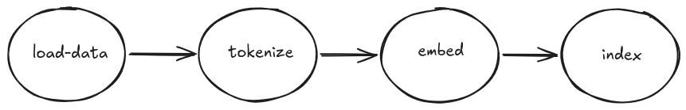

# Doc pipeline

This project implements a multi-stage document processing pipeline in Go:



Each stage is implemented as a pool of workers (goroutines) and the stages are connected via buffered channels.

To check the experiments, start [here](./experiments/01_runtime_telemetry.md).

## Build and run instructions

### Build docker image

```
docker build -t doc-pipeline:latest .
```

### Run with docker

```
docker run --rm -p 8080:8080 doc-pipeline:latest
```

### Run with docker-compose (including monitoring)

Run:
```
docker compose up
```

Prometheus UI is at `localhost:9090`
And Grafana is at `localhost:3000`


To stop the application and tear down monitoring infra:
```
docker compose down
```
