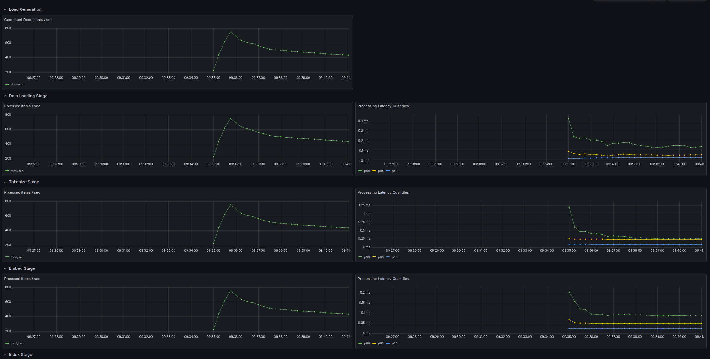
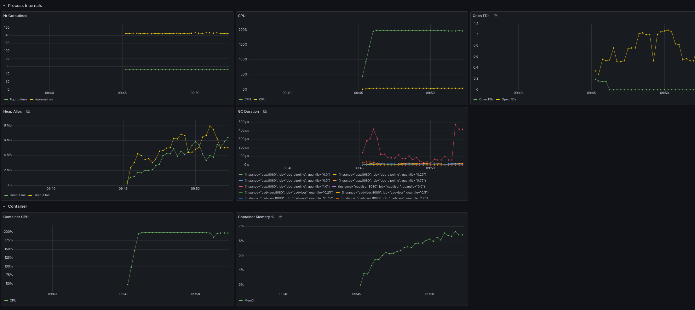

# Runtime telemetry

In this repo we spin up containers for Prometheus and Grafana along with our application to display our custom metrics along with some Go runtime internals and some system metrics from cAdvisor:

To begin with, we're generating 100 docs per second and running them through the whole pipeline. Each pipeline stage has 10 workers and a buffer of size 100. Everything's running smoothly and comfortably.

Let's push the number of documents to start discovering bottlenecks: let's try 1000:

We're definitely hitting a limit. Nothing is spiking in our custom metrics, but the CPU appears maxed out at 200% (note: we allocated 2.0 CPU units to our application container):

Since we appear to be limited by CPU saturation, it makes sense to check our continuous profiler to see where exactly the CPU time is spent.

[Next](02_pyroscope.md)

