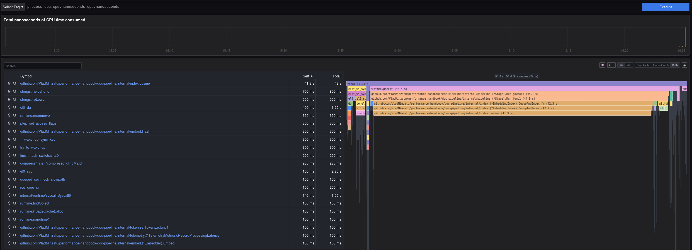
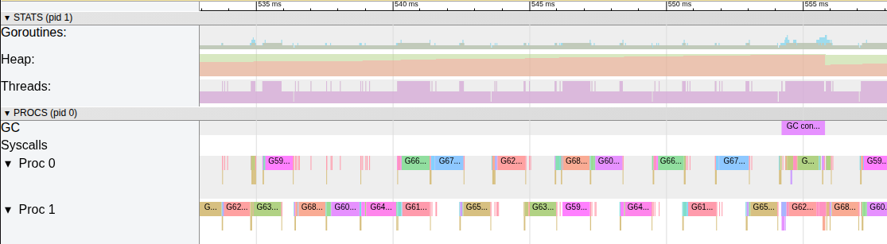

# Profiling with Go pprof

Since we appear to be CPU bound, let's look at a CPU profile. The code is amended with the pprof endpoint by importing `_ "net/http/pprof"`. 
So now we can run:
```
curl -o cpu.prof http://localhost:6060/debug/pprof/profile?seconds=30

go tool pprof cpu.prof
```

If we do a `top`, we get:
```
Showing top 10 nodes out of 30
      flat  flat%   sum%        cum   cum%
    45.50s 88.30% 88.30%     45.75s 88.78%  github.com/VladMinzatu/performance-handbook/doc-pipeline/internal/index.cosine (inline)
     1.33s  2.58% 90.88%      1.85s  3.59%  strings.FieldsFunc
     0.57s  1.11% 91.99%      0.57s  1.11%  internal/runtime/syscall.Syscall6
     0.48s  0.93% 92.92%      0.55s  1.07%  strings.ToLower
     0.32s  0.62% 93.54%      0.92s  1.79%  github.com/VladMinzatu/performance-handbook/doc-pipeline/internal/embed.(*Embedder).Embed
     0.32s  0.62% 94.16%      0.32s  0.62%  runtime.memmove
     0.27s  0.52% 94.68%      0.27s  0.52%  runtime.asyncPreempt
```

showing that the majority of the CPU time is spent on the CPU-bound cosine calculation, which is called inside DedupAndIndex. 

The reason it didn't show in the pyroscope flamegraph is probably down to inlining. We can check this by blocking the inlining of `cosine` with a `//go:noinline`. After rebuilding the image and restarting the whole stack, we see:



Indeed, everything seems to be working as expected and we get our flamegraphs from the ebpf-profiler.

Let's have a look at the tracing output as well:
```
curl -o trace.out http://localhost:6060/debug/pprof/trace?seconds=10

go tool trace trace.out
```
Producing the output (zoomed):



So taken together, we know that when the CPU is executing Go code, it is spending 90% of that time on the cosine computation. But we know that a CPU profile does not answer the question “Is the CPU fully utilized 100% of wall clock time?”.

We seem to also have headroom to optimize when it comes to idle regions, by looking at things such as pipeline backpressure, blocking syscalls, etc.


