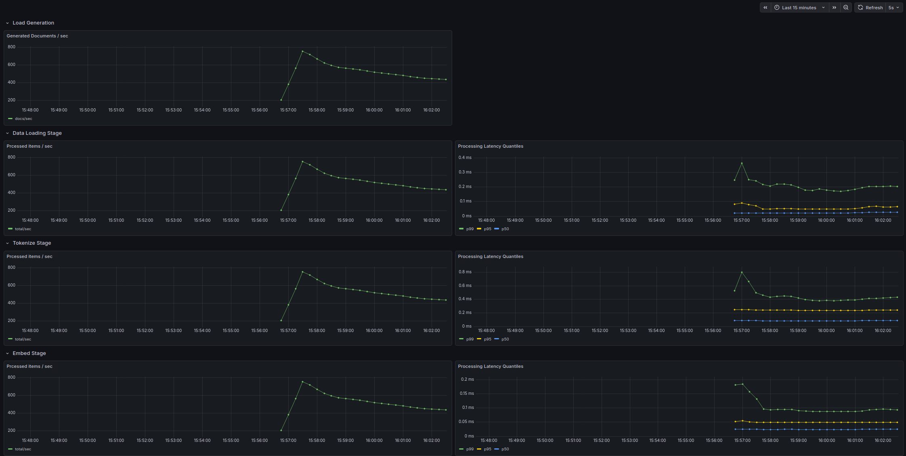

# Float32 operations

Because floating point multiplication is taking up the vast majority of the on-CPU time and there is no real need to use float64 which we defaulted to, it seems like potential low hanging fruit to try and get some throughput improvement from lowering the precision. A bit of online searching doesn't seem to offer much promise for this, but it's worth experimenting with.

After we rebuild and rerun we can observe the following behavior:

This is pretty much exactly the same behavior as before. No quick wins here.

