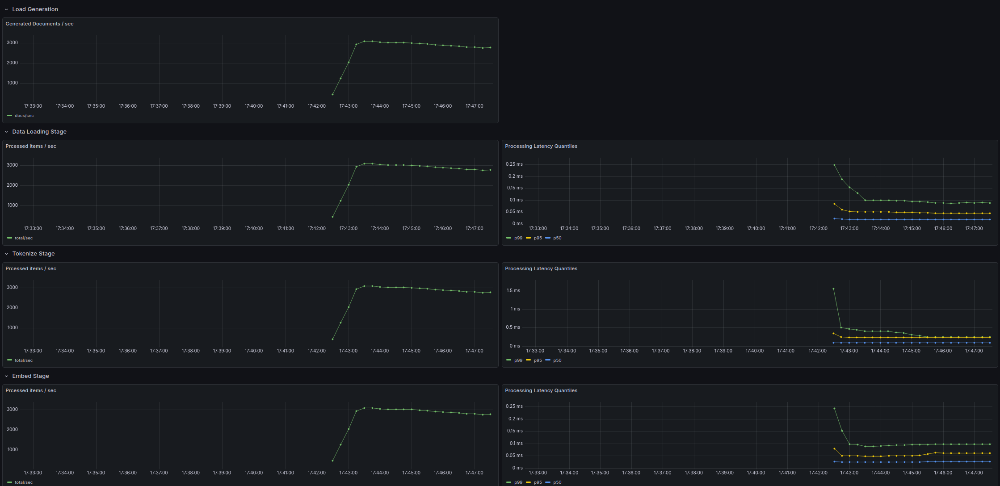
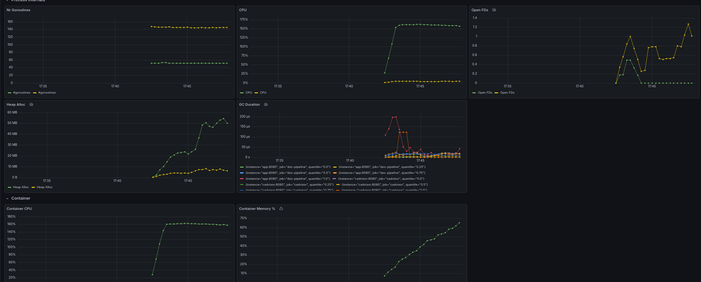
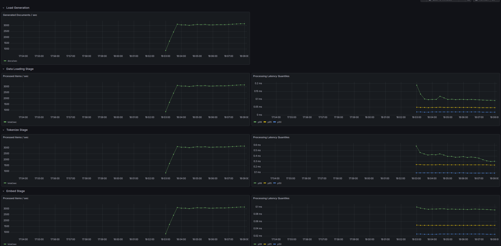
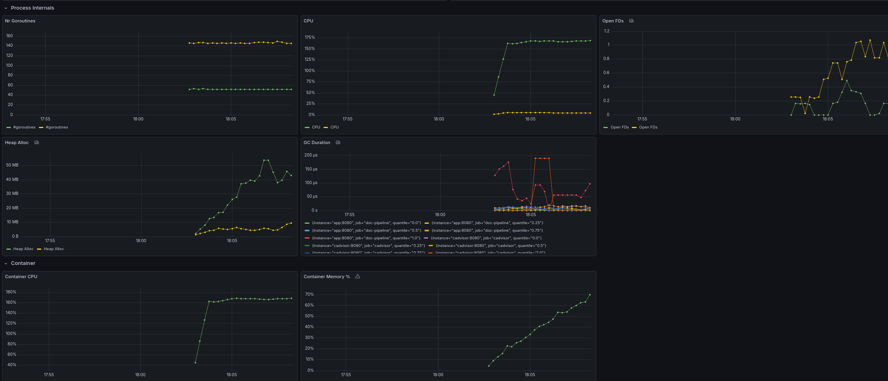
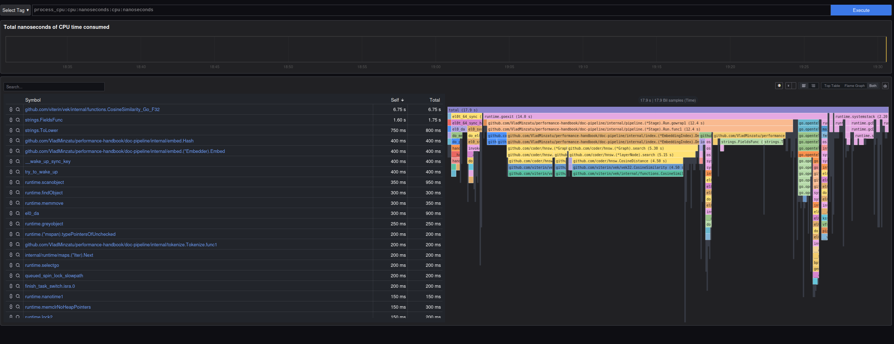

# HNSW

Instead of our brute-force approach of doing exhaustive nearest neighbor search against all the vectors indexed so far, we will use a specialised index (see the GH repo for the fascinating details of how it works): 

```
go get github.com/coder/hnsw@main
```

After the change, let's try running the pipeline again, trying to generate 4000 docs per second:




So now we are able to get much better throughput (3000 docs/s out of the 4000 we are attempting to get). 
And it also looks like we are no longer CPU bound (though not by a huge margin).

There is a low hanging fruit change we can still make: instead of using a Mutex lock around the whole index update method, we can use a RWMutex for more granular locking:




I would say pretty much in line with expectations: the improvement is noticeable, but not groundbreaking. Still, RWMutex is worth it.

We can also take a look at how the CPU profile has changed:


While the index updating logic is still the dominant user of CPU time, things look much more balanced now, with housekeeping and opentelemetry metrics updates coming well into view.

There are more efficient implementations of HNSW out there and other optimizations to try for CPU bound work, but at this point it's probably more interesting to look at what we can optimize off CPU.

[Next](./06_block_profile.md)
