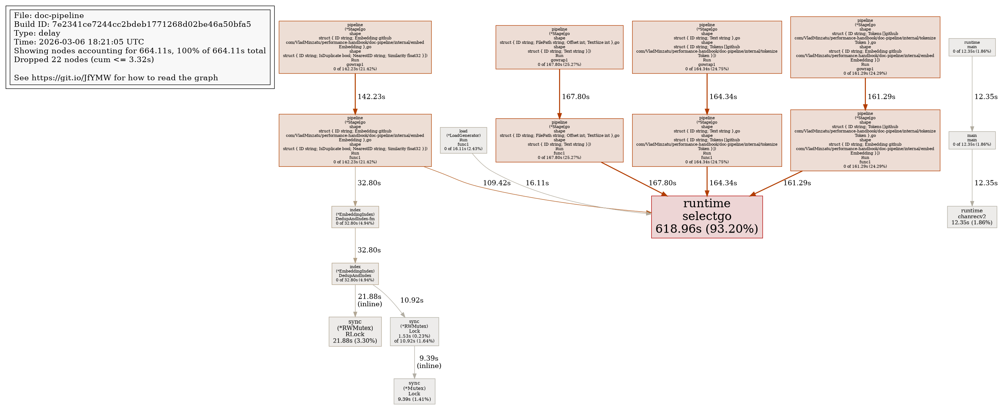
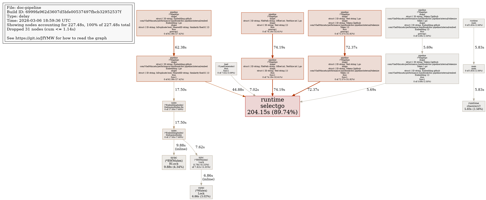
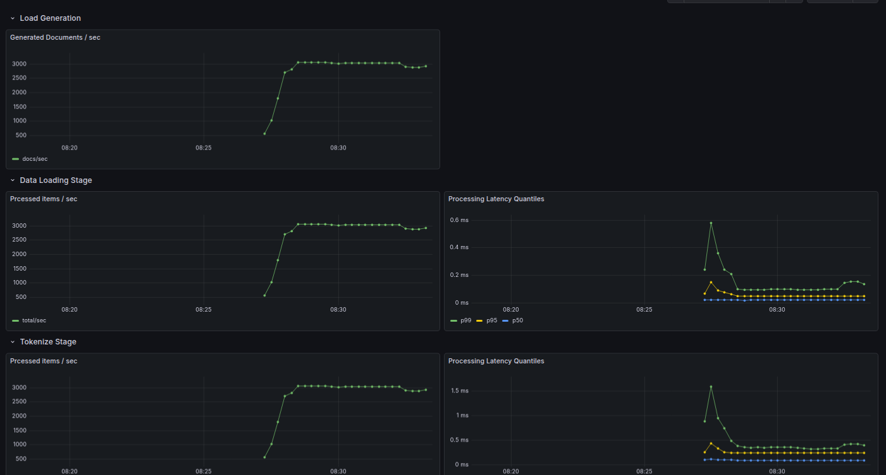
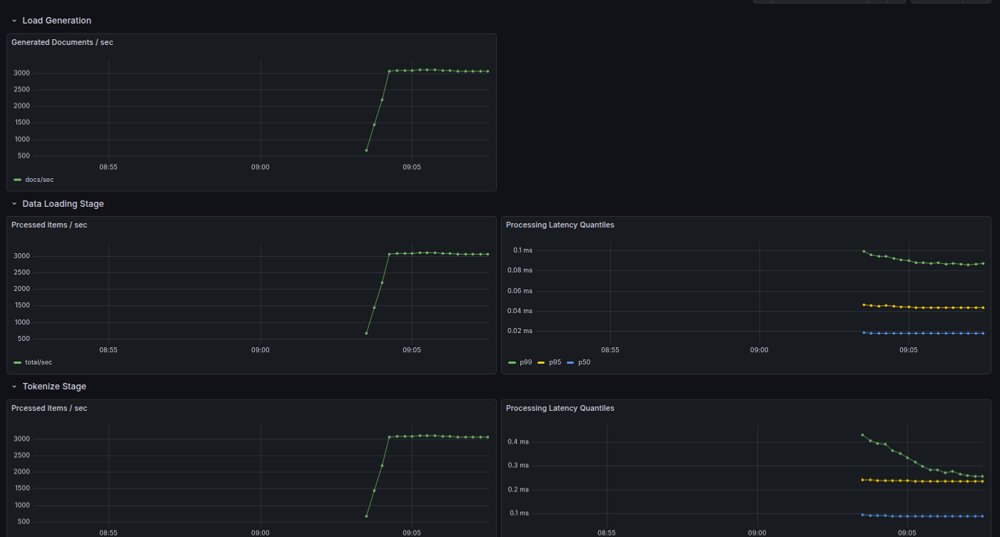
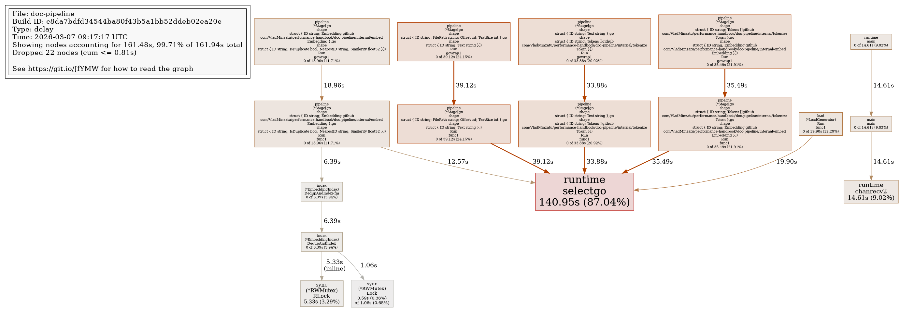
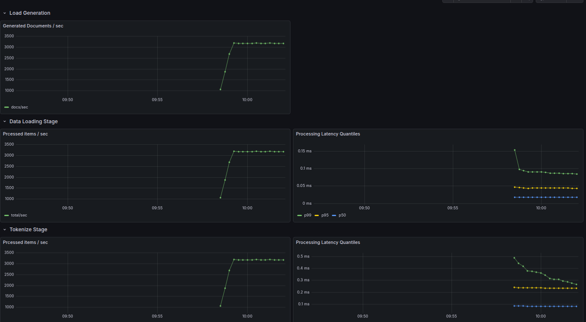
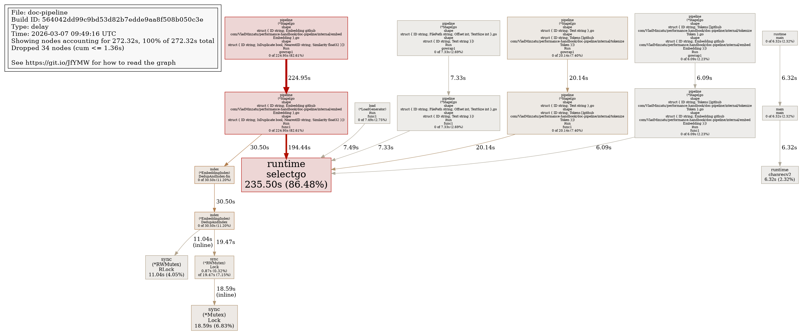
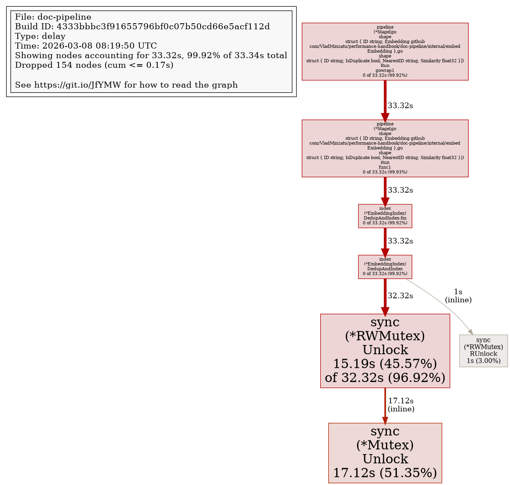

# pprof Block

With the pprof endpoint enabled and block profiling rate set to 1, we can use the Go tool to fetch the block profile data:
```
go tool pprof http://localhost:6060/debug/pprof/block
```

or alternatively:
```
curl http://localhost:6060/debug/pprof/block > block.prof
go tool pprof block.prof
```

Running `top` in the tool reveals the following:
```
(pprof) top
Showing nodes accounting for 664.11s, 100% of 664.11s total
Dropped 22 nodes (cum <= 3.32s)
Showing top 10 nodes out of 18
      flat  flat%   sum%        cum   cum%
   618.96s 93.20% 93.20%    618.96s 93.20%  runtime.selectgo
    21.88s  3.30% 96.50%     21.88s  3.30%  sync.(*RWMutex).RLock (inline)
    12.35s  1.86% 98.36%     12.35s  1.86%  runtime.chanrecv2
     9.39s  1.41% 99.77%      9.39s  1.41%  sync.(*Mutex).Lock (inline)
     1.53s  0.23%   100%     10.92s  1.64%  sync.(*RWMutex).Lock
```

So `select` is the top blocking site and it's not even close. But of course, each of our stages has 2 selects. Can we get anything more specific than this?

Recall that we started with all stages configured identically, with 10 workers and buffered channels with buffers of size 100 between them.

We can generate a block web by typing e.g. `png` to generate a png output:



The key thing to note here is that all stages block roughly equally, which indicates that the pipeline is balanced and synchronized at its throughput limit - there is no clear bottleneck. However, that does not mean that this throughput is optimal. After all, the time spent blocked in the `select` is an indication that *some* resources must be wasted, as we are having workers waiting instead of processing (bot note, however, that it could be as harmless as having too many workers throughout our pipeline).

To illustrate this, let's run an experiment: setting the number of workers of one of the stages (say, the `embed` step) to 1 (i.e. 1/10 the other stages).



Now the `embed` stage is spending less time than the others blocked in `select`. But what is happening overall? Let's check our dashboard:



If anything, this run looks more stable run and the "underpowered" embed step did not become a bottleneck. It just spends less time blocked compared to the other stages.

This makes sense if we consider that we are so CPU bound throughout the pipeline. Is the time spent blocked in `select`s an indication of the overhead we introduce with our excessive number of workers given our CPU-bound pipeline?

Let's see what happens with just 2 worker per stage (since we have 2 CPU units for our container):



Perhaps we've managed to eke out a slight throughput improvement. Let's see what the block profile looks like in this case.



It looks like we're back to balance in our pipeline, while having cut some of the overall block time.

What we've seen in this section is that we could spot some unnecessary overhead that we could eliminate. (we cut the number of workers by a factor of 5 without any loss in throughput).

But it hasn't brought us spectacular gains here. If we had some IO heavy stages sprinkled in there, we probably could have made some interesting changes, like put more workers in the IO stage to get some real visible improvements. We do have the document loading stage, but since we are using one relatively small backing document, it is probably well cached throuhout our pipeline run.

## Reaching a better balance

We know we are CPU bound, and having the same number of workers per stage does achieve a certain balance through scheduling and backpressure, but is this the best we can do? The fact that there is time spent blocking in our pipeline stages suggests that we can probably do better.

Since all work is CPU bound, shouldn't the CPU be shared to the different stages proportionally with the amount of work they do? We are already plotting the p99 per stage operation and we see the following values:
| Stage | p99 ms|
|---|---|
| Doc Load | 0.1 ms |
| Tokenize | 0.3 ms | 
| Embed | 0.1 ms | 
| Indexing | 3.0 ms |

It seems reasonable that provisioning 1, 3, 1 and 30 workers respectively should achieve ideal resource split:



It seems this really made a visible impact, even if not Earth shattering. We finally jumped above 3k docs/s to about 3.2k docs/s throughput. 

Is this the ideal split? We chose the numbers of workers per stage in a reasoned way, but only experimentation will tell for sure if this is ideal. What does the block profile say now?



The embed stage (the second to last stage) now jumps out as being blocked often. But that doesn't mean that it is the bottleneck. Since we are following a receive -> compute -> send pattern, what we are seeing here is consistent with the last stage being the bottleneck (the one we gave 30 workers to).

We may have overdone it with 30 workers, given that we know the last stage is completely CPU bound and has its own internal locking around the data structure access via RWMutex. 

While we're at it, let's have a look at the mutex profile as well:
```
```
curl http://localhost:6060/debug/pprof/mutex > mutex.prof
go tool pprof mutex.prof
```

```
The `top` output shows:
```
Dropped 154 nodes (cum <= 0.17s)
      flat  flat%   sum%        cum   cum%
    17.12s 51.35% 51.35%     17.12s 51.35%  sync.(*Mutex).Unlock (inline)
    15.19s 45.57% 96.92%     32.32s 96.92%  sync.(*RWMutex).Unlock
        1s  3.00% 99.92%         1s  3.00%  sync.(*RWMutex).RUnlock (inline)
         0     0% 99.92%     33.32s 99.92%  github.com/VladMinzatu/performance-handbook/doc-pipeline/internal/index.(*EmbeddingIndex).DedupAndIndex
         0     0% 99.92%     33.32s 99.92%  github.com/VladMinzatu/performance-handbook/doc-pipeline/internal/index.(*EmbeddingIndex).DedupAndIndex-fm

```

And the graph looks like this:


This confirms the contention that is responsible for some of the overhead. We can use this in later optimizations, but first, let's start by simply tweaking the number of workers in the last pipeline stage.
