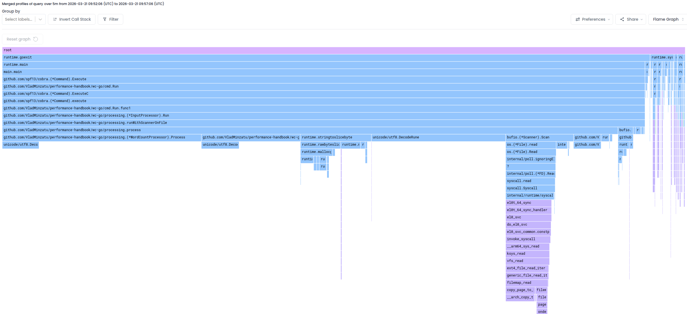
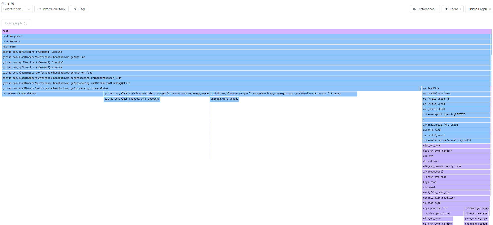
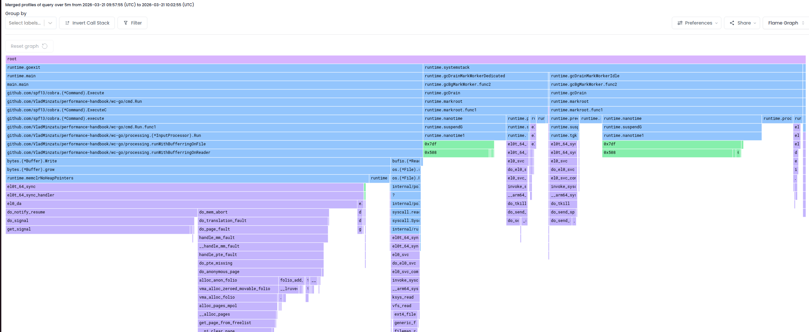
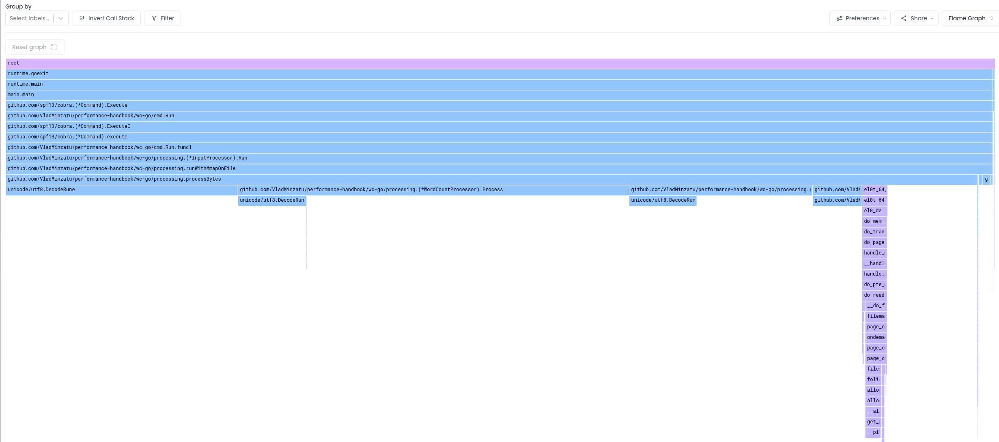
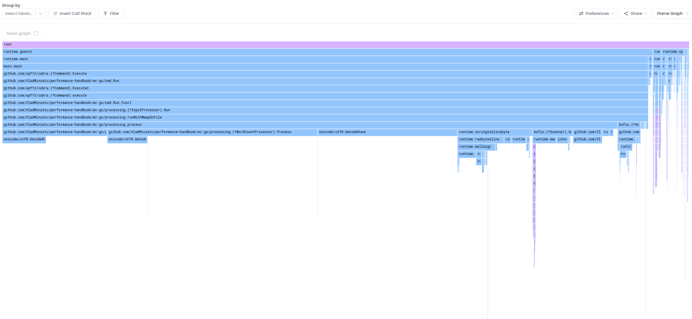

## Continuous Profiling

We will now look at the continuous profiling outputs for the different file processing strategies. We will use Parca and its agent this time. To start up the profilign infra, run:
```
docker compose up
```

And then we will be running our binary in a loop like so:
```
for i in {1..100}; do
  ./wc-go -p scanner shakespeare1000.txt
done
```

Note that we are using bigger files here (1000 x shakespeare) because for short lived processes, symbolization data is not yet available. So the runs produce the following outcomes:

`scanner`:


`upfront`


`buffering`


`mmap`


`mmap2`



Taken in conjunction with the timing observations, what can we take from this?
- Our outlier from the previous section was clearly the `buffering` strategy, which was also spending much more time in system calls. We can now see that writing to the buffer and growing the buffer are taking up a lot of CPU time. And in particular, the high number of page faults account for a lot of the overhead. The corresponding `do_notify_resume` calls are likely an indication of the high number of user <-> kernel transitions. So in summary, `bytes.Buffer.Write` causing frequent memory growth and page faults is likely the leading cause of this variant performing so poorly. And we also see corresponding high gc workload in this variant that doesn't appear in the other ones. Preallocating aggressively should greatly improve performance.
- While the user space time is very similar across all different runs, and we looked at the high outlier, there is also an outlier that is on the low end: the `mmap` approach to loading the data in memory is seemingly nearly an order of magnitude faster than performing a read. Well, this is according to the profiles, which measure on-CPU time of our process. This could be explained by the fact that `mmap` shifts the work from explicit syscalls to page-fault handling. So the difference is likely more of an artifact of where kernel work is accounted. `mmap` is also better able to take advantage of existing cached pages which it just maps, whereas `read()` still **copies** data from page caches to user buffers.


TODO:
- `perf stat -e page-faults ./wc-buffering` compared to others
- `perf stat -e page-faults,minor-faults,major-faults ./prog` and `perf record -g ./prog` to check mmap vs others
