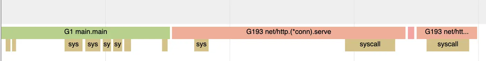

# db-query

A minimalist web server that provides a root endpoint `/` that retunes all the users stored in a backing Sqlite database.

Let's have a look at what our application is doing, starting with the Go performance tooling:

## Go perf tools

We'll start with the tracing. With our server running, we'll generate some load using `ab`:
```
ab -n 1000 -c 50 http://localhost:8080/
```

In our traces, during the processing of the generated traffic, we can see goroutines being scheduled that look like this:


The goroutines that serve the requests have the `read` syscall near the beginning (reading the request input) and the longer `write` syscall near the end as they write the output. There is then a connection `close` call.

Meanwhile, the `main` goroutine is also scheduled on different CPUs, accepting requests and spinning off goroutines to handle those requests.
