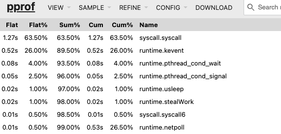
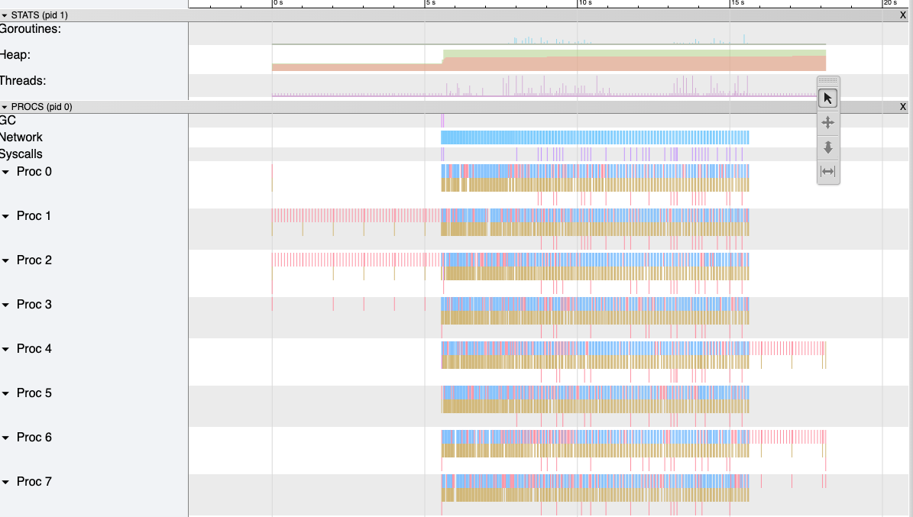
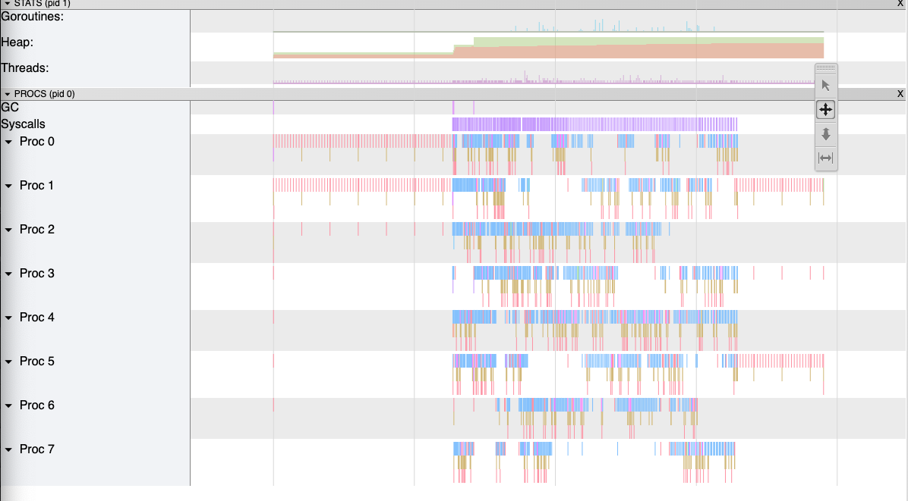

# net-v-netpoll

In this directory we have the code and results of running a series of tests comparing [Netpoll](https://github.com/cloudwego/netpoll) with Go's standard network stack for a series of different use cases.

Essentially, the standard library networking model is designed for blocking I/O APIs, so you can only follow the one-goroutine-per-connection model (although Go uses epoll under the hood for network calls). For high concurrency scenarios this adds overhead in the memory footprint of goroutines (small as it may be) and context switching. [Netpoll](https://github.com/cloudwego/netpoll) aims to fix that by using event-driven non-blocking I/O. No goroutines are blocked by I/O and I/O is handled asynchronously: when data is ready, you handle it and you can defer creating new goroutines only to when CPU-bound logic needs to run. This gives more fine grained control in handling concurrency and should lead to better performance for scenarios of long-lived connections or bursty or high volume traffic.

In this series, I want to generate the metrics to support and quantify those claims under varying workload types.

## Simple Echo Server

We'll first have a look at simple echo server implementations using the `net` package vs `netpoll`.

Under the `cmd` directory we have `netpoll_echo` for our implementation of the echo server using netpoll, as well as a `std_echo` directory for the standard library implementation. And there is a simple custom Go TCP load testing tool inside `cmd/tcpload.go`, as this seems like the most straightforward way to test our TCP servers (most tools out there are http load testing tools).

For the first experiments, I'm just going to be running the tests directly on my Mac and using Go profiling and observability tools.

Let's first give the servers a simple spin and see what observations our simple load testing tool collects. First, start the servers in two separate terminals with the commands:

```
go run cmd/netpoll_echo/echo_server_netpoll.go
...
go run cmd/std_echo/echo_server_std.go
```

And then run the load test on the standard lib server:

```
go run cmd/tcpload.go --host 127.0.0.1:8080 --users 1000 --duration 10s --message "hello" --interval 100ms
Starting test: 1000 users for 10s

=== Load Test Complete ===
Sent:     98728
Received: 98728
Failures: 0
Avg RTT:  1.069272ms
p90 RTT:  2.371583ms
p95 RTT:  3.227647ms
p99 RTT:  5.292031ms
```

And on the netpoll server:

```
go run cmd/tcpload.go --host 127.0.0.1:8081 --users 1000 --duration 10s --message "hello" --interval 100ms
Starting test: 1000 users for 10s

=== Load Test Complete ===
Sent:     97227
Received: 97227
Failures: 0
Avg RTT:  1.807808ms
p90 RTT:  3.977215ms
p95 RTT:  5.226495ms
p99 RTT:  7.491583ms
```

First crude reulsts are already rather interesting with the netpoll implementation being consistently quite a bit slower on avg RTT and this tracks into the higher percentile latencies as well.

Running a CPU profile during our "load test" shows how CPU time is spent in both cases. Below are "Top" views of the CPU profiles. Graph and flamegraph would be more visually compelling, but this is more readable embedded here:

**Standard web:**



**Netpoll:**


The thing that stands out for me here is that the netpoll implementation spends more time on thread conditions, whereas the net implementation makes more efficient use of the Go scheduler in this case. Not necessarily surprising, just interesting to look under the hood. Remember, we're just looking at a very specific usage pattern of a simple echo server processing small messages here.

Let's have a look at some traces and see what they reveal.

Using the `profile.TraceProfile` of the `github.com/pkg/profile` package we can generate traces that we can then inspect with ` go tool trace trace.out`.

**Standard web:**


**Netpoll:**


Some observations:

- of course, the netpoll implementation has only the one goroutine to handle requests, being scheduled on different cores at different times and mainly making syscalls. Meanwhile, the standard implementation uses hundreds of goroutines in total and it is easy to see that some goroutines running at the same time on different cores.
- on a related note, the number of running threads spikes to 8 regularly in the standard implementation, whereas in the netpoll implementatin we normally don't have more than the 1 running thread.

My interpretation of all this is that the implementation that uses the standard `net` package is better able to leverage the Go runtime and concurrency, primarily by letting multiple goroutines make read/write syscalls in parallel rather than forcing the individual read/writes to be sequenced as in the netpoll implementation. This advantage is real, because even at the kernel level, parallelism in handling such system calls is present to some extent (down to a certain level).

And this is a visible advantage here in our measurements because this particular use case is perfect for taking advantage of the concurrency in Go: we have no work to do in additional to the syscalls and minimal buffer copying. The results are not surprising. Netpoll is expected to shine in other use cases, such as large numbers of mostly idle connections (which is quite the opposite of what we've set up here).
