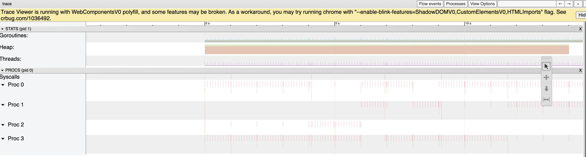

# sig-counter

Minimalist program to demonstrate signal handling in Go: a simple time ticker/counter with display and reset functionality.

## Go perf tools

Let's first look at a CPU profile, just to see what it looks like. If we run the process and run a couple of `kill -USR1 $PID` and `kill -USR2 $PID` commands, at the end we collect the following CPU profile:
```
(pprof) top10
Showing nodes accounting for 10ms, 100% of 10ms total
      flat  flat%   sum%        cum   cum%
      10ms   100%   100%       10ms   100%  runtime.kevent
         0     0%   100%       10ms   100%  runtime.findRunnable
         0     0%   100%       10ms   100%  runtime.mcall
         0     0%   100%       10ms   100%  runtime.netpoll
         0     0%   100%       10ms   100%  runtime.park_m
         0     0%   100%       10ms   100%  runtime.schedule
```

Not really surprisingly, there isn't much going on. As far as the profile can tell, we're spending all our CPU time blocked, waiting for timers and signals.

The Go runtime implements both timers and signal handling by sitting in a platform specific system call, which is `kevent` in macOS (it would probably be an `epoll*` on Linux).

Next, let's have a look at a trace under similar "load":


Much like matter in our universe, actual activity here is few and far between. 

However, with some very careful zooming, we can observe a few things:
- we see the expected "surge" in activity around each new second mark. We can see for instance that the activity happens within a few microseconds after the second mark. If the system were under heavier load, we'd probably see more variability and generally slightly bigger delays here.
- our goroutines are even so quite hard to spot. We can see how the runtime tracer itself is doing much more work and doing lots of write syscalls to write to the trace.out file. When ticks themselves happen, the goroutine is only running for about 20 microseconds.
- We can also very carefully spot the signals being received and processed. A goroutine titled `os/signal.loop` runs for less than 20 microseconds, with the main goroutine being scheduled immediately after to do its processing, including a syscall resulting from our printf.

## Linux Perf

Now that we've seen the Go runtime's view of things, let's look at it from the inside with Linux perf tools.
