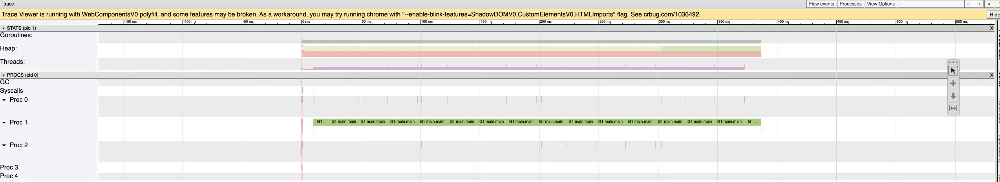
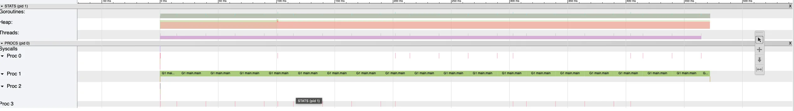

# wc-go

This is a simplified version of the standard Unix command-line utility [wc](https://man7.org/linux/man-pages/man1/wc.1.html). It doesn't support all the flags and arguments. In fact, it will always just print out the number of lines, number of words, and number of characters in the input. The input can be a file, or stdin in case no file path is provided as an argument.

Instead, though, it does support some other arguments (the `-p` flag), which indicate strategies for how we will process the input. (for our tests). The strategies we are testing are:
- `scanner` - creates a bufio.Scanner directly on the os.File (or stdin) to process the input line by line and allocate and return a string per line to be processed in successive calls to scanner.Text. This would be the most common, idiomatic approach that you would see in the wild - and probably appropriate in most cases.
- `upfront` - calls io.ReadAll or os.ReadFile depending on the case - loading the whole contents in memory before processing.
- `buffering` - manually fill the buffer that eventually contains all the data, loaded in chunks, and then do the processing.
- `mmap` - (only works with files) use the mmap system call to get read only access to the file data as a byte slice and then do the processing on it.
- `mmap2` - same as mmap, but we will process the file data using a scanner, just to see the effect.

In all strategies except for the `scanner` and `mmap2` ones, once the data is available as a byte slice, we do all processing directly on the bytes and avoid any extra heap allocations.

## Time tests

Let's start with the very basics: just about the simplest test we can run - timing the process run. I will use a file called `shakespeare100.txt`, which is formed by concatenating a file containing the complete works of Shakespeare 100 times over (this results in a file about 500MB in size - I did not check it in, obviously). A shakespeare.txt file can easily be found online and concatenating it can be done like so:

```
for i in {1..100};do cat shakespeare.txt >> shakespeare100.txt; done
```
So, running the times, first for the standard `wc` program:
```
% time wc shakespeare100.txt 
12418500 89958800 543647500 shakespeare100.txt
wc shakespeare100.txt  1.00s user 0.05s system 99% cpu 1.061 total
```

And now for the different versions of our own program:
```
% time ./wc-go -p scanner ~/shakespeare100.txt 
12418500	89958800	531229000
./wc-go -p scanner ~/shakespeare100.txt  4.35s user 0.15s system 96% cpu 4.655 total
```

```
% time ./wc-go -p upfront ~/shakespeare100.txt
12418500	89958800	531229000
./wc-go -p upfront ~/shakespeare100.txt  3.61s user 0.13s system 99% cpu 3.742 total
```

```
% time ./wc-go -p buffering ~/shakespeare100.txt
12418500	89958800	531229000
./wc-go -p buffering ~/shakespeare100.txt  3.94s user 0.33s system 104% cpu 4.094 total
```

```
 % time ./wc-go -p mmap ~/shakespeare100.txt
12418500	89958800	531229000
./wc-go -p mmap ~/shakespeare100.txt  3.64s user 0.04s system 99% cpu 3.676 total
```

```
% time ./wc-go -p mmap2 ~/shakespeare100.txt
12418500	89958800	531229000
./wc-go -p mmap2 ~/shakespeare100.txt  4.35s user 0.08s system 102% cpu 4.338 total
```

It's fair to say we didn't break new ground here, but what can we notice in these initial results?
- First, using `mmap` may feel clever, but it's probably not providing much benefit for our use case (it performs just about the same as reading everything up front). In fact, afaik, the original `wc` implementation uses `read()` syscalls to stream through the file in big contiguous chunks. Makes sense why that would be the most efficient way to go, when also considering that mmap could incur page faults. We'll need to dig into that a bit more. In general, it is known that performance benefits for memory mapped I/O are most likely when performing releated random access on large files. 
- Looking at the time differences between the runs of different `wc-go` variants, it is quite clear to see that there is a significant difference between the variants that perform additional allocations for each line before processing it and those who don't. Isn't it more than you'd expect? Maybe. In any case, interesting to observe if you've programmed in languages that steer you towards instantiating objects very liberally.
- And why are **all** `wc-go` variants considerably slower than the original? I would put that down to the Go runtime overhead and perhaps lack of some other compiler optimizations. We'll try to uncover that in more detail as well.

## Go perf tools

We will use github.com/pkg/profile to profile our application runs in various runs. Enabling profiling is a simple matter of adding the following line (or similar, depending on the type of profile) to the top of our `main` function and then running the process again and then running the appropriate `go tool` on the output:
```
defer profile.Start(profile.CPUProfile, profile.ProfilePath(".")).Stop()
```
Example of runing the pprof tool:
```
go tool pprof -http=:8080 cpu.pprof 
```
Although the graph view is the most interesting to look at in interactive mode, it's not nicely shareable here, so I will paste the output of `top10` where appropriate.

### CPU Profiles
- scanner:
```
Showing nodes accounting for 4.55s, 98.48% of 4.62s total
Dropped 24 nodes (cum <= 0.02s)
Showing top 10 nodes out of 51
      flat  flat%   sum%        cum   cum%
     4.22s 91.34% 91.34%      4.22s 91.34%  syscall.syscall
     0.11s  2.38% 93.72%      0.11s  2.38%  runtime.pthread_cond_wait
     0.11s  2.38% 96.10%      0.11s  2.38%  runtime.pthread_kill
     0.07s  1.52% 97.62%      0.07s  1.52%  runtime.usleep
     0.04s  0.87% 98.48%      0.04s  0.87%  runtime.kevent
         0     0% 98.48%      4.22s 91.34%  bufio.(*Scanner).Scan
         0     0% 98.48%      4.23s 91.56%  github.com/VladMinzatu/performance-handbook/wc-go/cmd.Run
         0     0% 98.48%      4.23s 91.56%  github.com/VladMinzatu/performance-handbook/wc-go/cmd.Run.func1
         0     0% 98.48%      4.23s 91.56%  github.com/VladMinzatu/performance-handbook/wc-go/processing.(*InputProcessor).Run
         0     0% 98.48%      4.23s 91.56%  github.com/VladMinzatu/performance-handbook/wc-go/processing.process
```
- upfront:
```
Showing nodes accounting for 3.62s, 99.18% of 3.65s total
Dropped 11 nodes (cum <= 0.02s)
Showing top 10 nodes out of 30
      flat  flat%   sum%        cum   cum%
     1.41s 38.63% 38.63%      1.41s 38.63%  unicode/utf8.DecodeRune
     0.70s 19.18% 57.81%      0.70s 19.18%  github.com/VladMinzatu/performance-handbook/wc-go/processing.isSpace (inline)
     0.56s 15.34% 73.15%      2.01s 55.07%  github.com/VladMinzatu/performance-handbook/wc-go/processing.(*WordCountProcessor).Process
     0.55s 15.07% 88.22%      1.21s 33.15%  github.com/VladMinzatu/performance-handbook/wc-go/processing.(*CharacterCountProcessor).Process
     0.34s  9.32% 97.53%      3.57s 97.81%  github.com/VladMinzatu/performance-handbook/wc-go/processing.processBytes
     0.04s  1.10% 98.63%      0.04s  1.10%  runtime.memclrNoHeapPointers
     0.02s  0.55% 99.18%      0.02s  0.55%  runtime.pthread_cond_signal
         0     0% 99.18%      3.62s 99.18%  github.com/VladMinzatu/performance-handbook/wc-go/cmd.Run
         0     0% 99.18%      3.62s 99.18%  github.com/VladMinzatu/performance-handbook/wc-go/cmd.Run.func1
         0     0% 99.18%      3.62s 99.18%  github.com/VladMinzatu/performance-handbook/wc-go/processing.(*InputProcessor).Run
```
- buffering:
```
Showing nodes accounting for 4030ms, 99.26% of 4060ms total
Dropped 14 nodes (cum <= 20.30ms)
Showing top 10 nodes out of 37
      flat  flat%   sum%        cum   cum%
    1500ms 36.95% 36.95%     1500ms 36.95%  unicode/utf8.DecodeRune
     850ms 20.94% 57.88%      850ms 20.94%  github.com/VladMinzatu/performance-handbook/wc-go/processing.isSpace (inline)
     450ms 11.08% 68.97%     2100ms 51.72%  github.com/VladMinzatu/performance-handbook/wc-go/processing.(*WordCountProcessor).Process
     380ms  9.36% 78.33%     1080ms 26.60%  github.com/VladMinzatu/performance-handbook/wc-go/processing.(*CharacterCountProcessor).Process
     360ms  8.87% 87.19%     3540ms 87.19%  github.com/VladMinzatu/performance-handbook/wc-go/processing.processBytes
     200ms  4.93% 92.12%      200ms  4.93%  runtime.usleep
     120ms  2.96% 95.07%      120ms  2.96%  runtime.memclrNoHeapPointers
     100ms  2.46% 97.54%      100ms  2.46%  syscall.syscall
      70ms  1.72% 99.26%       70ms  1.72%  runtime.memmove
         0     0% 99.26%      100ms  2.46%  bufio.(*Reader).Read
```
- mmap:
```
Showing nodes accounting for 3.69s, 99.46% of 3.71s total
Dropped 5 nodes (cum <= 0.02s)
      flat  flat%   sum%        cum   cum%
     3.69s 99.46% 99.46%      3.70s 99.73%  github.com/VladMinzatu/performance-handbook/wc-go/processing.processBytes
         0     0% 99.46%      3.71s   100%  github.com/VladMinzatu/performance-handbook/wc-go/cmd.Run
         0     0% 99.46%      3.71s   100%  github.com/VladMinzatu/performance-handbook/wc-go/cmd.Run.func1
         0     0% 99.46%      3.71s   100%  github.com/VladMinzatu/performance-handbook/wc-go/processing.(*InputProcessor).Run
         0     0% 99.46%      3.71s   100%  github.com/VladMinzatu/performance-handbook/wc-go/processing.runWithMmapOnFile
         0     0% 99.46%      3.71s   100%  github.com/spf13/cobra.(*Command).Execute (inline)
         0     0% 99.46%      3.71s   100%  github.com/spf13/cobra.(*Command).ExecuteC
         0     0% 99.46%      3.71s   100%  github.com/spf13/cobra.(*Command).execute
         0     0% 99.46%      3.71s   100%  main.main
         0     0% 99.46%      3.71s   100%  runtime.main
```
- mmap2:
```
Showing nodes accounting for 4500ms, 98.68% of 4560ms total
Dropped 23 nodes (cum <= 22.80ms)
Showing top 10 nodes out of 55
      flat  flat%   sum%        cum   cum%
    4000ms 87.72% 87.72%     4000ms 87.72%  runtime.memmove
     100ms  2.19% 89.91%      100ms  2.19%  runtime.pthread_cond_signal
     100ms  2.19% 92.11%      100ms  2.19%  runtime.usleep
      90ms  1.97% 94.08%       90ms  1.97%  runtime.pthread_cond_wait
      80ms  1.75% 95.83%       80ms  1.75%  runtime.kevent
      80ms  1.75% 97.59%       80ms  1.75%  runtime.pthread_kill
      50ms  1.10% 98.68%       50ms  1.10%  runtime.madvise
         0     0% 98.68%     4000ms 87.72%  bufio.(*Scanner).Scan
         0     0% 98.68%     4000ms 87.72%  bytes.(*Reader).Read
         0     0% 98.68%     4040ms 88.60%  github.com/VladMinzatu/performance-handbook/wc-go/cmd.Run
```

More than anything, these results show us how the CPU profiler works. A CPU profile samples where the program spends CPU cycles. I.e., importantly, that is not wall time that is being reported. This is important to keep in mind generally when profiling (and not just CPU profiling) - these techniques are typically useful in identifying bottlenecks and making comparisons, but be very careful with interpreting and comparing the raw numbers!

That explains why the `scanner` version spends 92% of its time doing `Read` syscalls (likely successively reading in chunks of 64KB at a time or so), while the percentages in the other profiles are dominated by the processing of the text data.

In general, a long running system call will likely not even show up in the profile (if there is just one or a small number of them), because during that time, the thread is parked and not using CPU cycles.

Next, let's look at the price we are paying for the faster versions of the program in terms of memory:

### Memory profiles

- scanner:
```
Showing nodes accounting for 116.46kB, 100% of 116.46kB total
Showing top 10 nodes out of 56
      flat  flat%   sum%        cum   cum%
   28.33kB 24.32% 24.32%    28.33kB 24.32%  runtime.acquireSudog
   25.41kB 21.82% 46.14%    51.84kB 44.52%  runtime.allocm
   16.89kB 14.50% 60.65%    16.89kB 14.50%  runtime.malg
   13.76kB 11.82% 72.47%    13.76kB 11.82%  runtime.makeProfStackFP (inline)
    8.06kB  6.92% 79.39%    14.39kB 12.36%  github.com/VladMinzatu/performance-handbook/wc-go/processing.process
    6.33kB  5.43% 84.82%     6.33kB  5.43%  bufio.(*Scanner).Scan
    5.23kB  4.49% 89.31%     5.23kB  4.49%  time.LoadLocationFromTZData
    4.39kB  3.77% 93.08%    18.78kB 16.12%  github.com/VladMinzatu/performance-handbook/wc-go/cmd.Run
    4.05kB  3.48% 96.56%     4.05kB  3.48%  github.com/pkg/profile.Start.func11
    4.01kB  3.44%   100%     9.24kB  7.93%  github.com/pkg/profile.Start
```
- upfront:
```
Showing nodes accounting for 518.47MB, 100% of 518.54MB total
Dropped 41 nodes (cum <= 2.59MB)
Showing top 10 nodes out of 11
      flat  flat%   sum%        cum   cum%
  518.47MB   100%   100%   518.47MB   100%  os.readFileContents
         0     0%   100%   518.47MB   100%  github.com/VladMinzatu/performance-handbook/wc-go/cmd.Run
         0     0%   100%   518.47MB   100%  github.com/VladMinzatu/performance-handbook/wc-go/cmd.Run.func1
         0     0%   100%   518.47MB   100%  github.com/VladMinzatu/performance-handbook/wc-go/processing.(*InputProcessor).Run
         0     0%   100%   518.47MB   100%  github.com/VladMinzatu/performance-handbook/wc-go/processing.runWithUpFrontLoadingOnFile
         0     0%   100%   518.47MB   100%  github.com/spf13/cobra.(*Command).Execute (inline)
         0     0%   100%   518.47MB   100%  github.com/spf13/cobra.(*Command).ExecuteC
         0     0%   100%   518.47MB   100%  github.com/spf13/cobra.(*Command).execute
         0     0%   100%   518.48MB   100%  main.main
         0     0%   100%   518.47MB   100%  os.ReadFile
```
- buffering
```
Showing nodes accounting for 786438.33kB, 100% of 786523.64kB total
Dropped 48 nodes (cum <= 3932.62kB)
Showing top 10 nodes out of 13
      flat  flat%   sum%        cum   cum%
  786432kB   100%   100%   786432kB   100%  bytes.growSlice
    6.33kB 0.0008%   100% 786438.33kB   100%  github.com/VladMinzatu/performance-handbook/wc-go/processing.runWithBufferringOnReader
         0     0%   100%   786432kB   100%  bytes.(*Buffer).Write
         0     0%   100%   786432kB   100%  bytes.(*Buffer).grow
         0     0%   100% 786442.45kB   100%  github.com/VladMinzatu/performance-handbook/wc-go/cmd.Run
         0     0%   100% 786438.33kB   100%  github.com/VladMinzatu/performance-handbook/wc-go/cmd.Run.func1
         0     0%   100% 786438.33kB   100%  github.com/VladMinzatu/performance-handbook/wc-go/processing.(*InputProcessor).Run
         0     0%   100% 786438.33kB   100%  github.com/VladMinzatu/performance-handbook/wc-go/processing.runWithBufferringOnFile
         0     0%   100% 786442.45kB   100%  github.com/spf13/cobra.(*Command).Execute (inline)
         0     0%   100% 786442.45kB   100%  github.com/spf13/cobra.(*Command).ExecuteC
```
- mmap
```
Showing nodes accounting for 36.77kB, 100% of 36.77kB total
Showing top 10 nodes out of 41
      flat  flat%   sum%        cum   cum%
   15.25kB 41.47% 41.47%    15.25kB 41.47%  runtime.allocm
    5.23kB 14.22% 55.69%     5.23kB 14.22%  time.readFile
    4.13kB 11.22% 66.92%     4.13kB 11.22%  github.com/spf13/pflag.NewFlagSet (inline)
    4.10kB 11.16% 78.07%     4.10kB 11.16%  os.statNolog
    4.05kB 11.03% 89.10%     4.05kB 11.03%  github.com/pkg/profile.Start.func11
    4.01kB 10.90%   100%     9.24kB 25.12%  github.com/pkg/profile.Start
         0     0%   100%     8.23kB 22.38%  github.com/VladMinzatu/performance-handbook/wc-go/cmd.Run
         0     0%   100%     4.10kB 11.16%  github.com/VladMinzatu/performance-handbook/wc-go/cmd.Run.func1
         0     0%   100%     4.10kB 11.16%  github.com/VladMinzatu/performance-handbook/wc-go/processing.(*InputProcessor).Run
         0     0%   100%     4.10kB 11.16%  github.com/VladMinzatu/performance-handbook/wc-go/processing.checkFilePath
```
- mmap2
```
Showing nodes accounting for 110.79kB, 100% of 110.79kB total
Showing top 10 nodes out of 50
      flat  flat%   sum%        cum   cum%
   35.58kB 32.11% 32.11%    49.34kB 44.54%  runtime.allocm
   20.15kB 18.19% 50.30%    20.15kB 18.19%  github.com/VladMinzatu/performance-handbook/wc-go/processing.process
   13.76kB 12.42% 62.72%    13.76kB 12.42%  runtime.makeProfStackFP (inline)
   12.67kB 11.43% 74.16%    12.67kB 11.43%  runtime.malg
    8.09kB  7.31% 81.47%     8.09kB  7.31%  runtime.acquireSudog
    4.39kB  3.96% 85.42%    24.53kB 22.15%  github.com/VladMinzatu/performance-handbook/wc-go/cmd.Run
    4.08kB  3.68% 89.10%     4.08kB  3.68%  regexp.compile
    4.05kB  3.66% 92.76%     4.05kB  3.66%  github.com/pkg/profile.Start.func11
    4.01kB  3.62% 96.38%     4.01kB  3.62%  github.com/pkg/profile.Start
    4.01kB  3.62%   100%     4.01kB  3.62%  runtime.(*timers).addHeap
```

The picture here is quite simple and not at all surprising: when we're reading the whole file into memory before processing (regardless of the strategy), we get the expected ~500MB memory footprint for our whole process.

And in the other variants, the memory footprint if very tiny, even dominated by the Go runtime itself (but tiny, most importantly).

But what's going on in the `mmap` versions? We're seeing a small memory footprint, but that can't be the whole story. The file contents are mapped directly into the process’s virtual address space by the kernel and not heap-allocated. So pprof (and Go's allocator) don't see the contents as heap objects.

In the background, pages of the file are loaded on demand via page faults when accessed. For our use case, the whole file size will likely be used in terms of memory space, and if the memory is insufficient for that, the kernel has to do more work to manage that. But we'll need other tools to observe this going on.

### Trace

By changing the first line in our `main` function to the following, we'll be able to obtain a trace file from our execution in the various runs:
```
defer profile.Start(profile.TraceProfile, profile.ProfilePath(".")).Stop()
```

A trace is handy because it not only shows us what consumes CPU, Memory and other resources, but also how the program executes and these resources are consumed over time. And Go perf tooling comes with a handy web UI for inspcting this trace output, which can be run like so:
```
go tool trace trace.out
```

As an example, let's compare our `scanner` implementation to our `upfront` implementation. 

Here's the `scanner` outcome:

And here is the `upfront` one:


The UI allows us to zoom in and out and observe quite detailed information about what happenes in our program as it's running. Here are some things we observe, that can be seen even in these screenshots (once pointed out, at least):
- With the `scanner` approach, we can see the expected pattern of making frequent evenly spaced out system calls to read data, followed by brief blocking and processing times. In the `upfront` run, we can see that a read system call is done in the beginning, followed by a gap where our goroutine is blocked, and then processing of the data is done by our main goroutine without much else going on. We also see the GC doing a lot more work, frequently popping up in the `scanner` approach, while GC activity is much less frequent in the other run.
- Consequently, we're not surprised by what we see happening with the heap (near the top of the UI). In the `scanner` version, the overall heap size fluctuates, but is kept low at all times. Whereas in the `upfront` run, the heap is filled to a size roughly equalling the file size in the beginning (between the syscall and our goroutine starting processing) and then stays at that level throughout the process' lifetime. 
- The UI also shows us goroutine and thread counts near the top, but we don't have anything interesting going on there, as both versions of our program just have the one main goroutine doing all the work.


Now let's look at one more trace here, because it's fascinating - the `mmap` run:


This loooks like the best of both worlds, doesn't it? We have both low heap usage and low GC overhead. But remember, `go tool trace` records events inside the Go runtime: goroutine scheduling, syscalls that Go made directly, GC pauses, network poller activity, etc. We can see the `mmap` syscall being made, for instance, in the beginning.

However, it's important to keep in mind that even the Go trace tool's view of the system is limited and there's lots more going on behind the scenes that could impact performance. Once the initial `mmap` syscal is made, our goroutine is simply accessing memory after that. As application programmers, we're used to thinking of memory access as being basically free. So what can possibly hurt performance that is outside of what we see here? Well, as the CPU is reading from memory, when it touches an unmapped page the hardware raises a page fault exception, the kernel loads the relevant page from disk into memory and updates the page tables.

The Go tracer doesn't notice at all when this is potentially happening, because the mechanism here is not a syscall, it's an exception (a page fault exception, specifically). When that happens, the goroutine never calls into the runtime to say “I’m blocked.”. So the Go scheduler doesn't context-switch away from the goroutine, so no goroutine state change event is emitted into the trace. To Go, it looks like the goroutine was on the CPU and running normally. At the hardware level though, the thread is effectively paused while the kernel handles the fault, but it is not blocked in the sense where the scheduler would mark it as sleeping. During that time, though, the kernel is indeed executing code on behalf of our process (in the page fault handler, possibly doing disk I/O !!!).

This is an example of why, our complete performance analysis toolkit needs to include tools that go beyond analysing the peformance of what is visible to the Go runtime - we need OS level tools.

## Linux and BPF Tools

Let's continue looking into the `mmap` version behaviour. As we saw, whatever file reads happen (on page faults), they are invisible to the Go runtime and thus, also to the tracer. As far as it can tell, our goroutine is going along, never blocked, reading from memory, processing and writing back to memory. But we suspect that there's much more to the story - we know there's more complex things going on under the hood. How can we get some visibility into that?

### Standard Linux perf tools

On Linux, it makes sense to start with `perf` tools. How can it help us out here? We can run:
```
sudo perf stat -e page-faults,minor-faults,major-faults ./wc-go -p mmap ~/shakespeare100.txt 
```

and it will give us the following output:
```
 Performance counter stats for './wc-go -p mmap shakespeare100.txt':

             8,605      page-faults                                                           
             8,601      minor-faults                                                          
                 1      major-faults                                                          

       3.831913027 seconds time elapsed

       3.719923000 seconds user
       0.123196000 seconds sys

```
We're getting some interesting insights that we didn't have before, like the user vs. sys time. But more to our point, we get a clear counter for the number of minor faults vs major faults. This may look a bit surprising at first. Major faults happen when disk I/O is done, but a minor fault only means page tables being updated in memory, because the data itself for the page is already cached, so this is much faster.

What's more, if we run the same command again, we get the following output:
```
Performance counter stats for './wc-go -p mmap shakespeare100.txt':

             8,614      page-faults                                                           
             8,614      minor-faults                                                          
                 0      major-faults                                                          

       3.617099471 seconds time elapsed

       3.578519000 seconds user
       0.049048000 seconds sys
```
You can probably guess what happened here: the data is still cached from the previous run because the kernel hasn't had a reason to clear those pages, so we're getting a nice boost in our runtime (remember that `mmap` is meant for repeated random access in large files primarily - we just happened to be doing it in separate runs of our process...and we're also not accessing randomly).

But getting back to the first run, we only paid for one major fault in order to cache our whole 500MB file? That sounds like a deal a little too good to be true. We need to dig deeper and collect some more numbers. Enter [bpftrace](https://github.com/bpftrace/bpftrace).

### bpftrace

First of all, we can count the major faults with a bpftrace one-liner like so, just as a confirmation that we can trust what we're seeing:
```
sudo bpftrace -e 'software:major-faults { @[comm] = count(); }'
```
If we run our program again, sure enough, bpftrace gives us this output (I've recreated our test file in the meantime):
```
@[wc-go]: 1
```

Ok, great, but what we'd really like to do is get quantitative at this point and understand what kind of overhead `mmap` really incurs in our use case. With `bpftrace`, we can get a lot more insights. For example, this one-liner:
```
sudo bpftrace -e 'kprobe:handle_mm_fault { @ts[tid] = nsecs;} kretprobe:handle_mm_fault /@ts[tid]/ {@lat[comm] = hist(nsecs - @ts[tid]); delete(@ts[tid]);}'
```
can give us a histogram of times spent handling memory map faults. And this is the output it gives:
```
...
@lat[wc-go]: 
[256, 512)            30 |                                                    |
[512, 1K)           4432 |@@@@@@@@@@@@@@@@@@@@@@@@@@@@@@@@@@@@@@@@@@@@@@@@@@@@|
[1K, 2K)            3768 |@@@@@@@@@@@@@@@@@@@@@@@@@@@@@@@@@@@@@@@@@@@@        |
[2K, 4K)             342 |@@@@                                                |
[4K, 8K)              30 |                                                    |
[8K, 16K)           2164 |@@@@@@@@@@@@@@@@@@@@@@@@@                           |
[16K, 32K)          1775 |@@@@@@@@@@@@@@@@@@@@                                |
[32K, 64K)           196 |@@                                                  |
[64K, 128K)           18 |                                                    |
[128K, 256K)           4 |                                                    |
[256K, 512K)           6 |                                                    |
[512K, 1M)             2 |                                                    |
[1M, 2M)               2 |                                                    |
[2M, 4M)               0 |                                                    |
[4M, 8M)               1 |                                                    |
...
```

we can see that the majority of the latencies are around the microsecond mark. I have an SSD in this machine, and we'd expect an I/O read to be in the tens to hundreds of microseconds. And some handler calls do take that long. That 4-8ms call looks like it must have done some heavy lifting.

Nevertheless, very few high latency fault handler invocations. Let's note that what we see here sums up to about 30ms. As it tunrs out, Linux has some more tricks up its sleeve that give us a boost here, namely a mechanism called "readahead". This detects that we are going through our file sequentially and loads more data than needed when it seems like we will be accessing it. Let's verify if this is indeed what is happening, by running:
```
sudo bpftrace -e 'kprobe:page_cache_async_ra { @[comm] = count(); }'
```
And sure enogh, the output is:
```
@[wc-go]: 4147
```
There it is, doing the work so we don't bump up against those pesky major faults. And if we run it again on the same file, we get no more readaheads, because, of course, the file is already cached as we saw before.

## System-level comparison: `mmap` vs `upfront`

We went rather deep on `mmap`, but what about the other versions of our code? Now that we've run quite a few kinds of tests, let's focus on the system-level view of 2 versions of our code: `upfront` and `mmap`. These were the 2 best performing versions under our test conditions: we're using a fairly large file, but clearly one that fits quite comfortably in memory. If the file were much larger, `mmap` would have more work to do (more higher latency operations involved) and `upfront` wouldn't be feasible, so we'd have to compare it against `scanner`. But for now, let's focus on this use case with `mmap` vs. `upfront`.

### perf tools

Let's start with the big picture:
```
sudo perf stat -d ./wc-go -p mmap ~/shakespeare100.txt
```

This gives us the following output:
```
Performance counter stats for './wc-go -p mmap ~/shakespeare100.txt':

          3,870.47 msec task-clock                       #    1.001 CPUs utilized             
               622      context-switches                 #  160.704 /sec                      
                32      cpu-migrations                   #    8.268 /sec                      
             8,619      page-faults                      #    2.227 K/sec                     
...
       3.865924351 seconds time elapsed

       3.726353000 seconds user
       0.148212000 seconds sys
```

and for the upfront version:
```
 Performance counter stats for './wc-go -p upfront ~/shakespeare100.txt':

          3,932.69 msec task-clock                       #    0.999 CPUs utilized             
               601      context-switches                 #  152.822 /sec                      
                20      cpu-migrations                   #    5.086 /sec                      
           133,378      page-faults                      #   33.915 K/sec                     
...
       3.937098892 seconds time elapsed

       3.630355000 seconds user
       0.306126000 seconds sys
```

What jumps out here is that the sys time in the upfront implementation is roughly double compared to `mmap`. This could have something to do with the fact that the `upfront` implementation also has to copy the data from page cache to user buffers, which costs CPU (memcpy in the kernel). We also see way more page-faults reported for the `upfront` version, which looks surprising. This might have something to do with how page-faults are counted here, as again, the `upfront` version can fault on both the file pages and the buffer pages.

We can run a `sudo perf record -g ./wc-go -p upfront ~/shakespeare100.txt` followed by `sudo perf report` (and similarly for `mmap`) and observe where exactly the upfront version spends more time in syscalls and we will indeed see vfs_read dominating there, but also quite a bit of time on *_copy_to_user.

Now let's have a deeper look into this comparison using bpftrace.

### bpftrace


